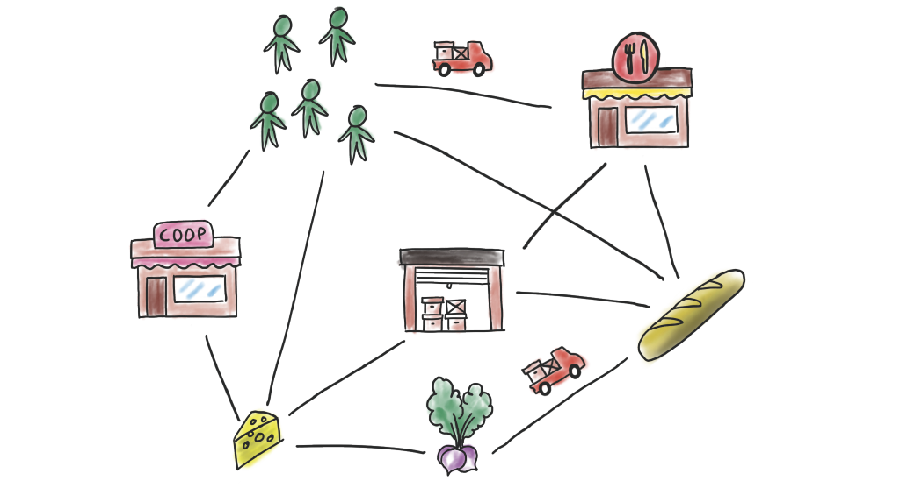
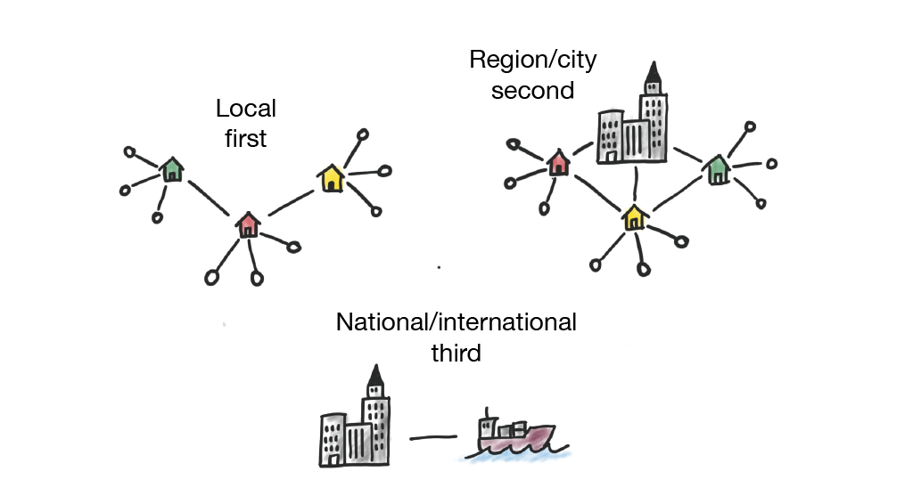
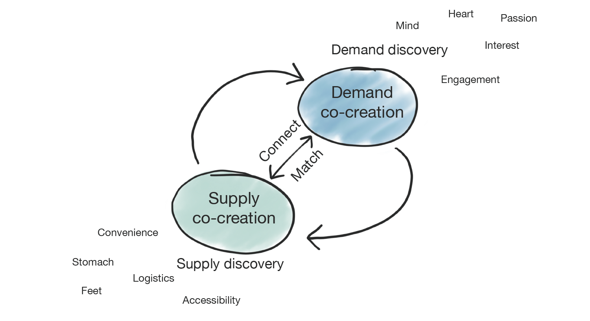
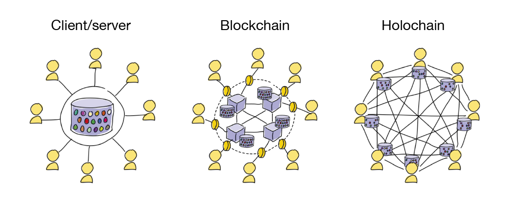

Shiro is a local first supply chain network on a mission to create thriving regenerative food systems. A multi stakeholder platform cooperative – open source, owned and managed by all active participants from local consumers to regional wholesalers.

Shiro moves beyond food as a commodity and people as consumers. Participation on the platform means an active food citizenship to support the development of a democratic, socially and economically just, and environmentally regenerative food system. 

We envision a platform that allows for many local initiatives to link up and become truly an ecosystem that supports regenerative development.

## Shiro builds a new food system from the bottom up, not top down

Local first, that is our focus! Then region and city. After that national and international where possible.

It's about scaling out, not scaling up! It's about rejuvenating communities and creating thousands of jobs in thousands of small coops and companies. Let's eliminate middlemen to achieve affordable food for consumers *and* increased profitability for producers. The vision with Shiro is a local economy where value is circulated rather than extracted, where locally created value stays local!

## Shiro bridges the gap between producers and consumers

There is gap in local food systems, a gap between producers and consumers, between supply and demand. 

**Producers** find it difficult to make ends meet
- Selling online is complicated and not well suited to food products
- Running an on farm store takes time, costs money, requires marketing, etc
- Chain grocery stores rather not work with small producers
- Local produce markets, direct restaurant sales, CSA programs, they all have advantages but also major drawbacks.

**Consumers** would like to choose local products more but often ends up visiting the chain grocery store out of time constraints, convenience etc.

With Shiro we want to bridge the gap between producers and consumers, enabling new streams of products and services within the food system. We want to move away from centralised economies of extraction to co-created economies of shared value. Built on trust, community and sense of belonging.

Shiro connects supply and demand and matches existing offers with consumer needs and wants. When value is unlocked it stimulates creation of new business models through a virtuous cycle of supply/demand discovery and co-creation.

## A multi sided matching engine at the core

Shiro uses [ValueFlows](https://valueflo.ws) and REA, models for distributed economic networks where resources flow from agent to agent via events. Objects such as resources, events, agents, proposals, intentions, actions, commitments and processes can be combined in novel configurations to facilitate a multitude of business scenarios.

Agents in our network are the consumers, the producers, food hubs of different kinds as well as everyone involved in the logistics that lets the ecosystem thrive.

Shiro will support new business models as well as established:
- Direct sales (store, webshop)
- Community Suppported Agriculture (subscriptions)
- Buyers clubs (group ordering)
- Pre-ordering
- Etc.

## Built on [Holochain](https://holochain.org), the next generation application platform 

Holochain is an open-source development framework and networking protocol. It allows for truly serverless applications with high levels of security, reliability, and performance. Holochain is modular, resilient and encrypted by design, handles value and transactions securely like a blockchain but without the scaling issues.

---

Contact us at:
- [Email info@shirocoop.xyz](info@shirocoop.xyz)
- [Forum at foodshift.se](https://foodshift.se/c/workspaces/shiro/37)
- [Chat at Telegram](https://t.me/shirocoop) 
